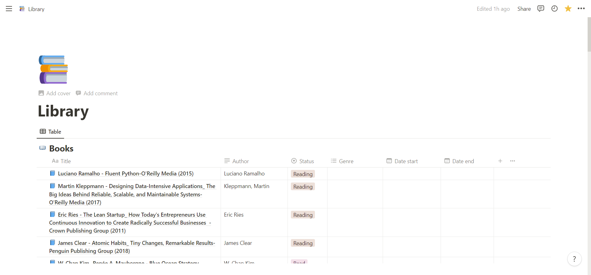
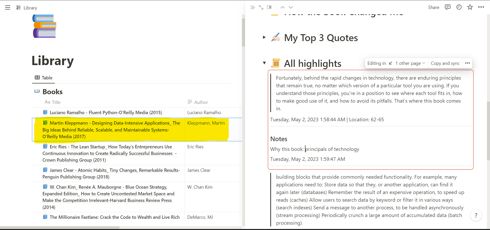
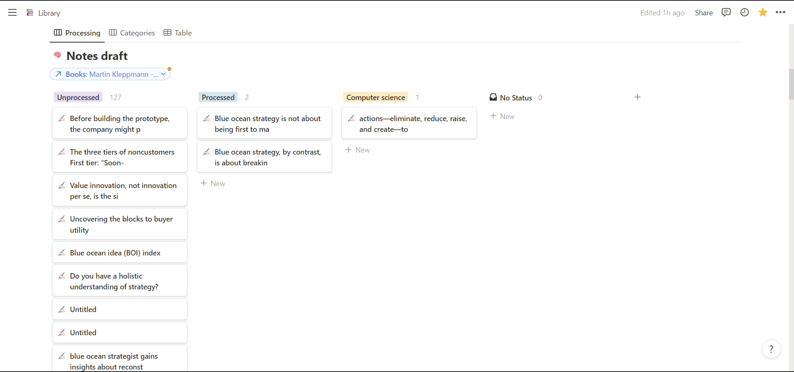
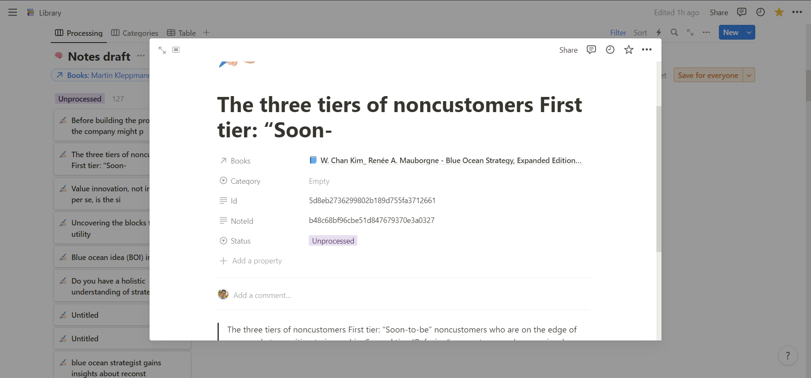
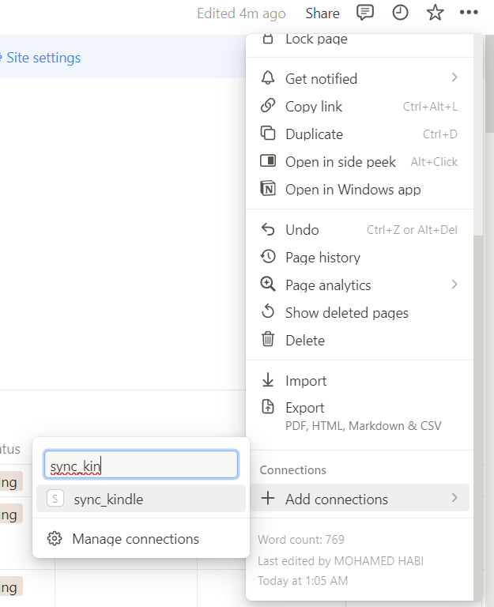
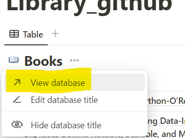
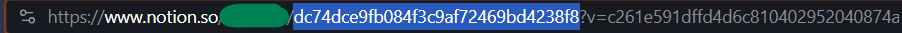

# kindle2notionTS:
Welcome to **kindle2notionTS**, your ultimate tool for synchronizing Kindle notes and highlights into a well-organized Notion template.

The template is inspired from [@elizabethfilips](https://www.youtube.com/watch?v=4bxpsvcW2mc) and [@aliabdaal](https://www.youtube.com/watch?v=AjoxkxM_I5g).

This tool utilizes the `My Clippings.txt` file extracted from your Kindle, containing all your notes and highlights.
# The notion template briefly:
We have a dataset of books, when clicking on each book, we can write its summery and other information, and see all the notes taken for that book.


We have a dataset of highlights, each linked to a book, and each of them represents a page.

Each highlight is a sync block, that is synchronized with 'All notes' in the book page. If you do any modification to your note it will automaticly synchronize with all other sync blocks refrencing it.




# How to use this:
1. clone the repo: `git clone https://github.com/Mohamedhabi/kindle2notionTS.git`

2. run: `npm run install`

3. run: `npm run build`

4. copy `My Clippings.txt` file to the root of the project.

5. create a copy of the notion template, by following this [link](https://med-hb.notion.site/Library_github-6601ec057df74eb89698b1bd943b2f8b?pvs=4).

6. go to [https://www.notion.so/my-integrations](https://www.notion.so/my-integrations) create a new integarion and copy the "integration Secrets".

7. add the integration to your library notion page
    <p align="center">
    
    </p>

8. get the book dataset id
    <p align="center">
    
    
    </p>

8. get the highlights dataset id, same as 8

9. create .env file and put in it:

    ```
    NOTION_SECRET=<<YOUR INTEGRATION SECRET FROM 6>>
    DATABASE_ID_BOOKS=<<YOUR BOOKS DB ID FROM 8>>
    DATABASE_ID_HIGHLIGHTS=<<YOUR HIGHLIGHTS DB ID FROM 9>>
    ```
10. run `npm run start`

enjoy 😛
will try to re-write this one day